# Structural_and_Behavioral_modeling
 sumador de 64bits

En este proceso del diseño de un sumador de x64 bits nos basamos en la hoja de asignacion , la cual indica que se debe empezar con un sumador completo (Fulladder) y partiendo de esta base se debe hacer un sumador de dos bits luego un sumador de 4 bits hasta llegar al sumador de x64 bits el cual debe de estar compuesto por instancias de un sumador de x32 bits. En las siguientes imagenes se ira describiendo la realizacion de todo el proceso.

primero de se realizo el sumador completo , el cual cuanta con tres entradas y dos salidas , las entradas seran A , B y Cin siendo Cin el acarreo de entrada , y las salidas van a ser Sout que sera la suma y Cout siendo el acarreo de salida.
  

Luego tendremos el sumador de dos bits que esta conformado por dos intacias del fulladder, este sumador de dos bits tendra 5 entradas y 3 salidas. Las entradas seran A1 , A2 , B1 ,B2, Cin y las salidas son out 1 ,out 2 y Cout.

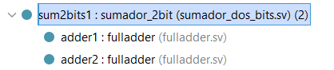 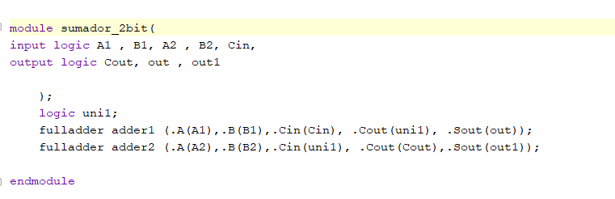 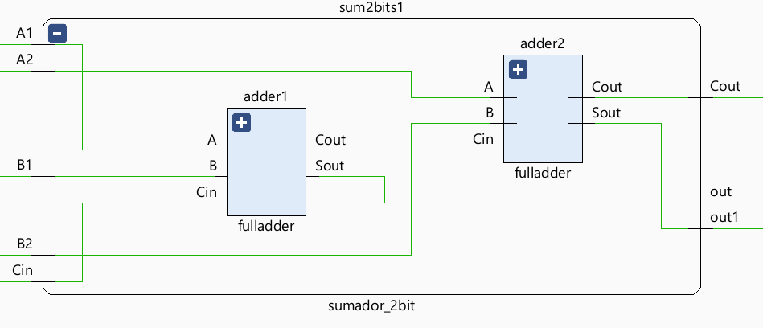

Teniendo el sumador de 2 bits se procedio hacer el sumador de 4 bits que esta hecho con dos sumador de x2 bits. este sumador tiene 8 entradas y 5 salidas.

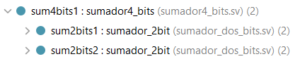 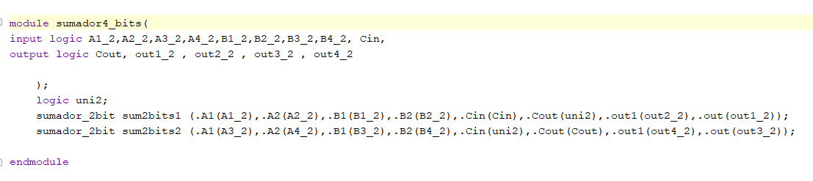 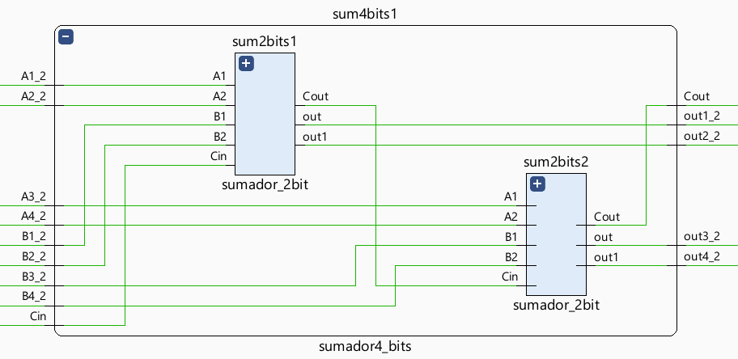

Partiendo del sumador de x4 bits se procedio hacer el sumador de x8 bits que esta hecho con 2 sumadores de x4 bits en cascada.

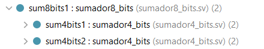 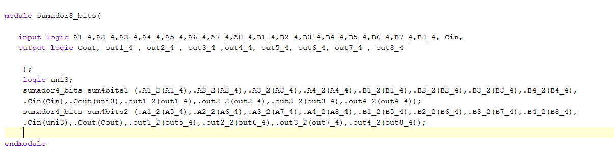 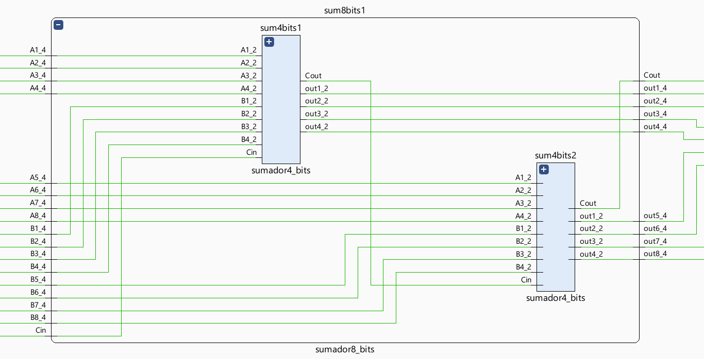

El sumador de x16 bits esta compuesto de igual forma de dos sumadores de x8 bits y quedo de la siguiente manera

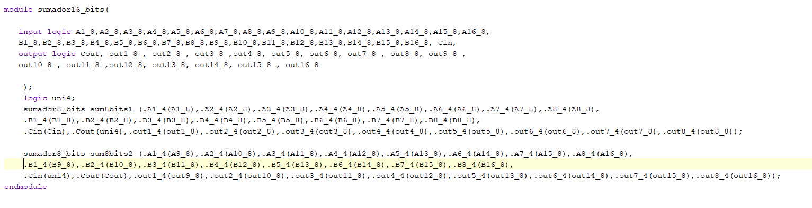 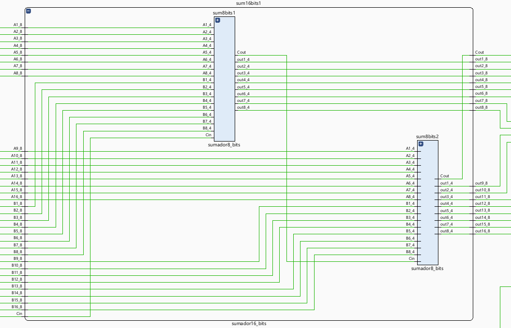

el sumador de x32 bits esta hecho con dos sumadore de x16 bits en cascada

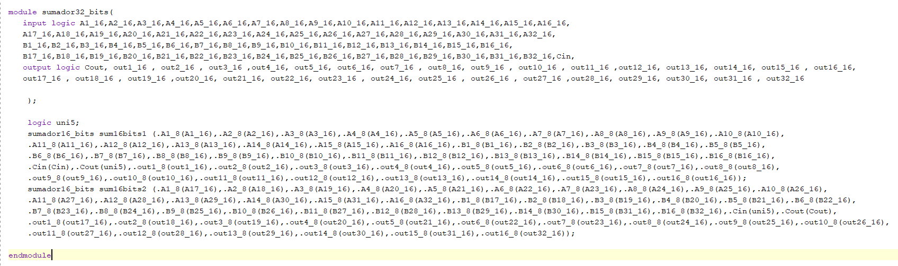 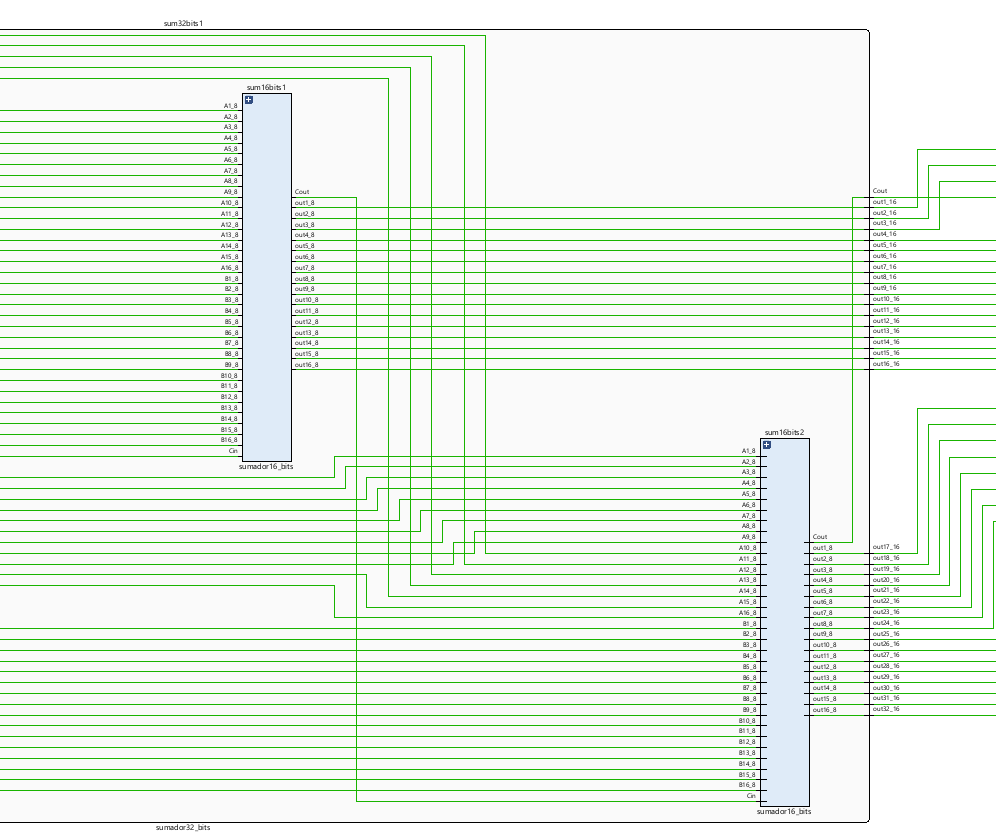

Finalmente el sumador de x64 bits esta hecho con dos sumadores de x32 bits en cascada y quedo de la siguiente forma:

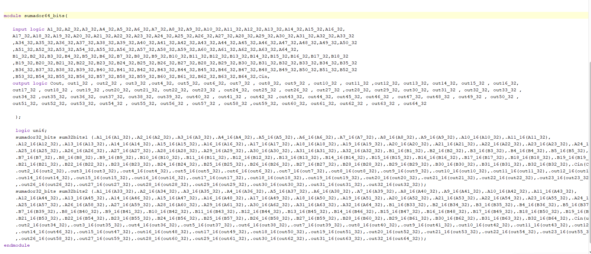 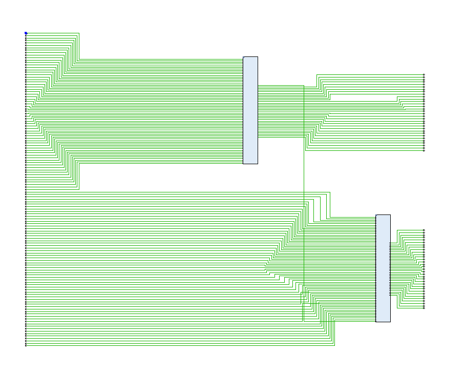

