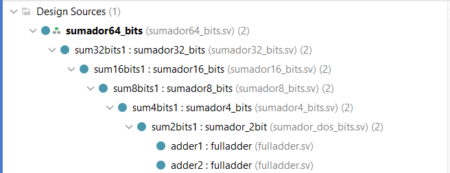
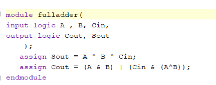
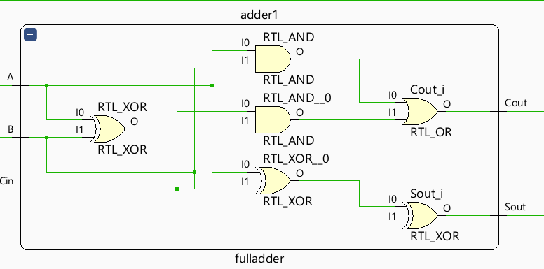

# Structural_and_Behavioral_modeling
 sumador de 64bits

En este proceso del diseño de un sumador de x64 bits nos basamos en la hoja de asignacion , la cual indica que se debe empezar con un sumador completo (Fulladder) y partiendo de esta base se debe hacer un sumador de dos bits luego un sumador de 4 bits hasta llegar al sumador de x64 bits el cual debe de estar compuesto por instancias de un sumador de x32 bits. En las siguientes imagenes se ira describiendo la realizacion de todo el proceso.

primero de se realizo el sumador completo , el cual cuanta con tres entradas y dos salidas , las entradas seran A , B y Cin siendo Cin el acarreo de entrada , y las salidas van a ser Sout que sera la suma y Cout siendo el acarreo de salida.
  

